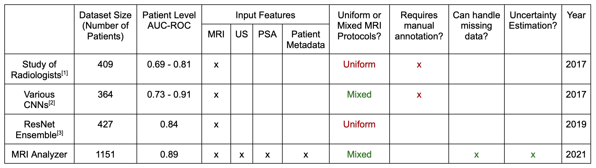

    

  
<strong>MRI ANALYZER</strong>

  
<strong>Piotr Parkitny | pparkitny@ischool.berkeley.edu</strong>

  
<strong>Dhyani Parekh  | dhyanip7@ischool.berkeley.edu</strong>

  
<strong>Aidan Jackson  | aidanjackson@ischool.berkeley.edu</strong>

  
<strong>Candice Sener  | senercansu@ischool.berkeley.edu</strong>
  

<!-- TABLE OF CONTENTS -->
## Table of Contents

* [Overview](#overview)
* [Results](#results)
* [Citations](#citations)

<!-- OVERVIEW -->
Overview
------------
This repository provides final pipeline code for MRI Analyzer, the capstone project for the co-authors' Master of Information and Data Science (MIDS) program at the University of California, Berkeley.

MRI Analyzer provides an end-to-end pipeline capable of taking a variety of patient medical information and providing a prostate cancer diagnosis. This product offers flexibility to patients who only have a partial data record available, qualifies its predictions with uncertainty estimates at each step, and matches in-practice metrics of cancer diagnosis. With this, accuracy and speed improvements can be achieved over current practice while still maintaining usefulness in a variety of healthcare scenarios.

For a general overview of results, see the file `Final_Presentation.pdf`.

<!-- Results -->
Results
------------

    

<!-- Citations -->
Citations
------------

Publications Compared to in Results Table:

[1] Sonn GA, Fan RE, Ghanouni P, Wang NN, Brooks JD, Loening AM, Daniel BL, To’o KJ, Thong AE, Leppert JT. Prostate Magnetic Resonance Imaging Interpretation Varies Substantially Across Radiologists. Eur Urol Focus. 2019 Jul;5(4):592-599. doi: 10.1016/j.euf.2017.11.010. Epub 2017 Dec 7. PMID: 29226826.
 
[2] Minh Hung Le et al 2017 Phys. Med. Biol. 62 6497

[3] Yoo, S., Gujrathi, I., Haider, M.A. et al. Prostate Cancer Detection using Deep Convolutional Neural Networks. Sci Rep 9, 19518 (2019). 

Dataset Citations:

[4] Natarajan, S., Priester, A., Margolis, D., Huang, J., & Marks, L. (2020). Prostate MRI and Ultrasound With Pathology and Coordinates of Tracked Biopsy (Prostate-MRI-US-Biopsy) [Data set]. The Cancer Imaging Archive. DOI: 10.7937/TCIA.2020.A61IOC1A

[5] Sonn GA, Natarajan S, Margolis DJ, MacAiran M, Lieu P, Huang J, Dorey FJ, Marks LS. Targeted biopsy in the detection of prostate  cancer using an office based magnetic resonance ultrasound fusion device.  Journal of Urology 189, no. 1 (2013): 86-91. DOI: 10.1016/j.juro.2012.08.095

[6] Clark K, Vendt B, Smith K, Freymann J, Kirby J, Koppel P, Moore S, Phillips S, Maffitt D, Pringle M, Tarbox L, Prior F. The Cancer Imaging Archive (TCIA): Maintaining and Operating a Public Information Repository, Journal of Digital Imaging, Volume 26, Number 6, December, 2013, pp 1045-1057. DOI: 10.1007/s10278-013-9622-7
